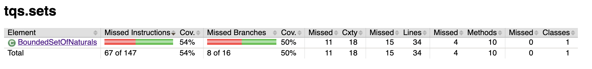
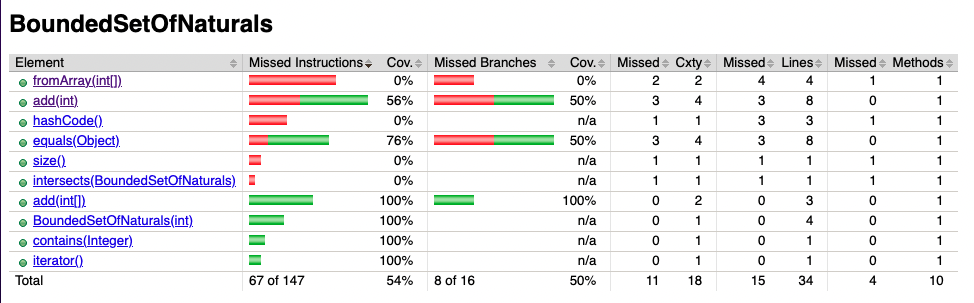

# TQS - Lab1

## Lab 1.2: Euromillions

Após a geração do relatório de code coverage usando o plugin JaCoCo, podemos ver que o coverage para a classe `BoundedSetOfNaturals` é apenas de 54%, o que não é o ideal.

Através da última imagem podemos concluir que o método `fromArray` não está a ser testado, uma vez que apresenta um code coverage de 0%. O mesmo acontece com o método `intersects`, `size` e `hashCode`.

## What kind of unit test are worth writing for proper validation of BoundedSetOfNaturals?

Para testar a classe `BoundedSetOfNaturals` de forma a garantir que o seu comportamento é o esperado, devemos efetuar as seguintes verificações:

1. O size é 0 após a sua cronstrução;
2. Após a inserção de n elementos válidos, verificar se o size é n;
3. Após inserção de um elemento repetido, verificar se é lançada uma exceção do tipo `IllegalArgumentException`;
4. Após a inserção de um elemento quando o size já é igual ao limite, verificar se é lançada uma exceção do tipo `IllegalArgumentException`;
5. Após a construção de um `BoundedSetOfNaturals` com um array de elementos válidos, verificar se o size é igual ao número de elementos do array;
6. Após a construção de um `BoundedSetOfNaturals` com um array de elementos onde pelo menos um é inválido, verificar se é lançada uma exceção do tipo `IllegalArgumentException`;
7. O hashcode do mesmo `BoundedSetOfNaturals` é igual;
8. O hashcode de diferentes `BoundedSetOfNaturals` são diferentes;
9. A interseção é verdadeira quando é feita com um subconjunto do `BoundedSetOfNaturals` a testar;
10. A interseção é falsa quando é feita com um conjunto que não é subconjunto do `BoundedSetOfNaturals` a testar;

Adicionei um getter para obter o maxSize para dps verificar se o fromArray define o maxSize corretamente.