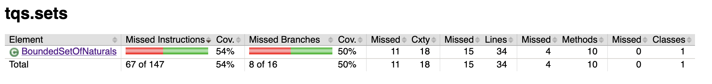
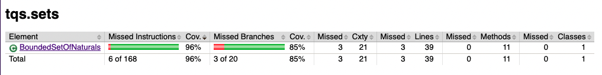
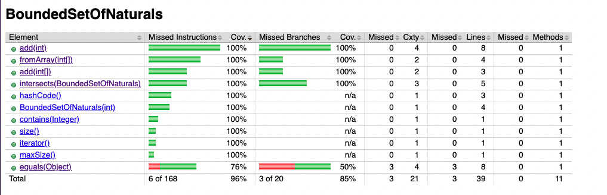

# TQS - Lab 1

## Lab 1.2: Euromillions

Após a geração do *code coverage report* usando o plugin Jacoco, podemos concluir que o coverage para a classe `BoundedSetOfNaturals` é apenas de 54%, o que não é o ideal.

Foi também possivel verificar que o code coverage era reduzido devido ao facto de os Unit Tests desenvolvidos não testarem certos métodos da classe, nomeadamente os métodos `fromArray`, `intersects`, `size` e `hashCode`, como se pode verificar na imagem seguinte.

 

## "What kind of unit test are worth writing for proper validation of BoundedSetOfNaturals?"

Para testar a classe `BoundedSetOfNaturals` de forma a garantir que o seu comportamento é o esperado, devemos efetuar as seguintes verificações:

1. O size é 0 após a sua cronstrução, no caso de não ser utilizado o método `fromArray`;

2. Na construção de um `BoundedSetOfNaturals` através do método `fromArray`, o size e o maxSize são iguais ao número de elementos do array e todos os elementos do array encontram-se no set criado;

3. Na construção de um `BoundedSetOfNaturals` através do método `fromArray`, utilizando um array inválido, é lançada uma exceção do tipo `IllegalArgumentException`;

4. Após a inserção de um elemento válido e o set não estar cheio, o set passa a conter o elemento inserido e o size é incrementado;

5. Após inserção de um elemento inválido (negativo), é lançada uma exceção do tipo `IllegalArgumentException`;

6. Após inserção de um elemento já presente no set, é lançada uma exceção do tipo `IllegalArgumentException`;

7. Após a inserção de um elemento quando o size já é igual ao limite, verificar se é lançada uma exceção do tipo `IllegalArgumentException`;

8. O hashcode de dois sets com exatamente os mesmos elementos são iguais;

9. O hashcode de dois sets com pelo menos um elemento distinto são diferentes;

10. A interseção é verdadeira quando é feita com um subconjunto do `BoundedSetOfNaturals` a testar;

11. A interseção é falsa quando é feita com um conjunto que não é subconjunto do `BoundedSetOfNaturals` a testar;

> Nota: Foi adicionado um *getter* do atributo `maxSize` na classe `BoundedSetOfNaturals` de modo a que seja possível testar se o maxSize é igual ao tamanho do array passado como argumento ao método `fromArray`.

 

## Code Coverage after adding new tests

Após os desenvolvimento dos testes supracitados, a percentagem de code coverage aumentou para 96%. Não foram desenvolvidos mais testes de modo a alcançar a marca dos 100%, uma vez que nem todo o código tem interesse em ser testado, neste caso o método `equals`.

Em situações reais, não existe qualquer interesse em que o code coverage seja de 100%, pois isso signficaria que código que não deveria ser testado está a ser testado. Exemplos deste tipo de código são os *getters* e *setters*, *framework code*, etc.

 

---

## Unit Testing *(notes)*

### What is Unit Testing?

Unit Testing is a type of software testing where individual units or components of a software are tested. The purpose is to validate that each unit of the software code performs as expected. Unit Testing is done during the development (coding phase) of an application by the developers. Unit Tests isolate a section of code and verify its correctness. A unit may be an individual function, method, procedure, module, or object.

### Why perform Unit Testing?

There are several advantages of performing unit testing, namely:

- Unit tests help to fix bugs early in the development cycle and save costs.

- It helps the developers to understand the testing code base and enables them to make changes quickly.

- Good unit tests serve as project documentation.

- Increase confidence in the code.

### Unit testing best practices

- Unit Test cases should be independent. In case of any enhancements or change in requirements, unit test cases should not be affected.

- Test only one code at a time.

- Follow clear and consistent naming conventions for your unit tests.

- Bugs identified during unit testing must be fixed before proceeding to the next phase in SDLC.

### What is code coverage?

Code coverage is a measure which describes the degree of which the source code of the program has been tested. It is one form of white box testing which finds the areas of the program not exercised by a set of test cases.

In most cases, code coverage system (e.g Jacoco) gathers information about the running program. It also combines that with source code information to generate a report about the test suite’s code coverage.

Some reasons why code coverage is important:

- It helps you to measure the efficiency of test implementation.

- It offers a quantitative measurement.

- It defines the degree to which the source code has been tested.

 

## References

<https://www.guru99.com/unit-testing-guide.html>

<https://www.guru99.com/code-coverage.html>
