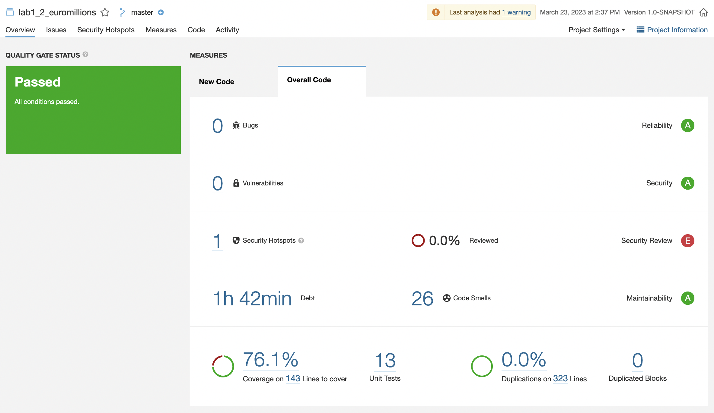

# Lab 6.1 - Local analysis

## F - Has your project passed the defined quality gate?



As we can see the project passed the quality gate.

The Quality Gate is a set of measure-based Boolean conditions. It helps us know immediately whether the project is production-ready. If the current status is not Passed, we'll see which measures caused the problem and the values required to pass.

<br>

## G - Explore the analysis results and complete with a few sample issues, as applicable.

| Issue | Problem Description | How to solve |
| --- | --- | --- |
| Bug |  -  | - |
| Vulnerability | - | - |
| Code smell 1 (major) | Counter updated in the body of the loop (<code>for (int i = 0; i < 10) {i++}</code>). | Change the counter value inside the for loop "header" (<code>for (int i = 0; i < 10; i++) {...}</code>). |
| Code smell 2 (major) | Testing equality or nullness with JUnit’s assertTrue() or assertFalse() | Testing equality or nullness with JUnit’s assertTrue() or assertFalse() should be simplified to the corresponding dedicated assertion (use ```assertEquals``` instead of ```assertTrue(equality)```) |
| Code smell 2 (major) | Passing concatenated strings into a logging method can incur a needless performance hit because the concatenation will be performed every time the method is called, whether or not the log level is low enough to show the message. | The built-in string formatting should be used instead of string concatenation, and if the message is the result of a method call, then Preconditions should be skipped altogether, and the relevant exception should be conditionally thrown instead. |


