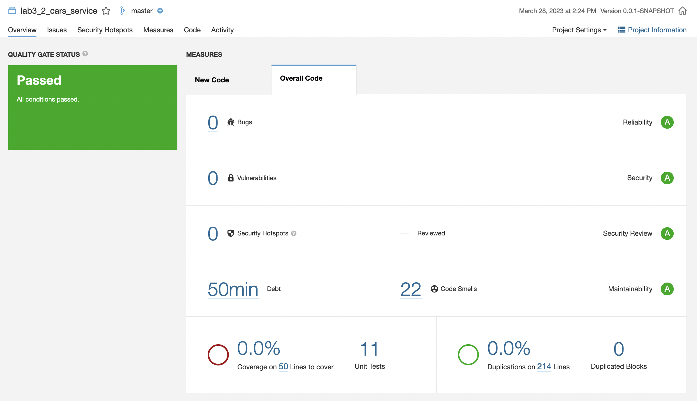
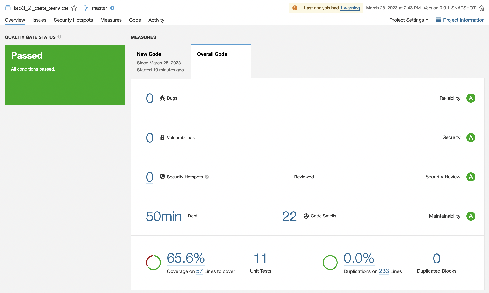
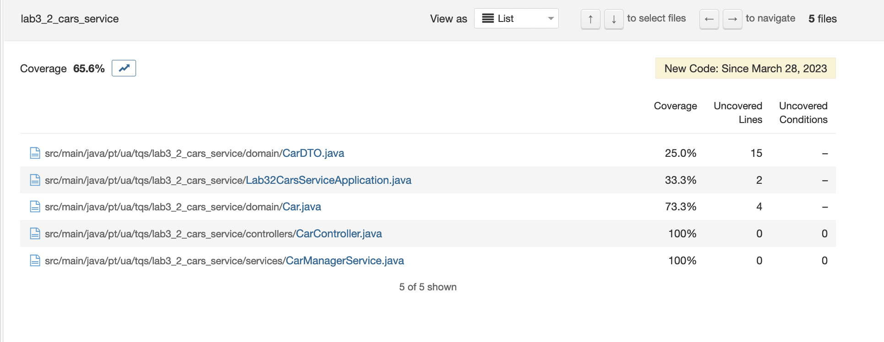

# Lab 6.2 - Technicaldebt(Cars)

## A - Technical debt

The technical debt obtained is 50 min.

Technical debt in SonarQube refers to the amount of effort required to fix all the technical issues, vulnerabilities and code smells present in the codebase. An 8-hour day debt is assumed when values are shown in days.

Given this, a technical debt of 50 minutes means that it would take 50 minutes to fix all code smells present in the codebase.

 

## D - Code Coverage

- As we can see in the image above, the code coverage is 65.6%. This means that 65.6% of the code is exercised by tests. 
- There are 21 uncovered lines.
- There are 0 uncovered conditions.
