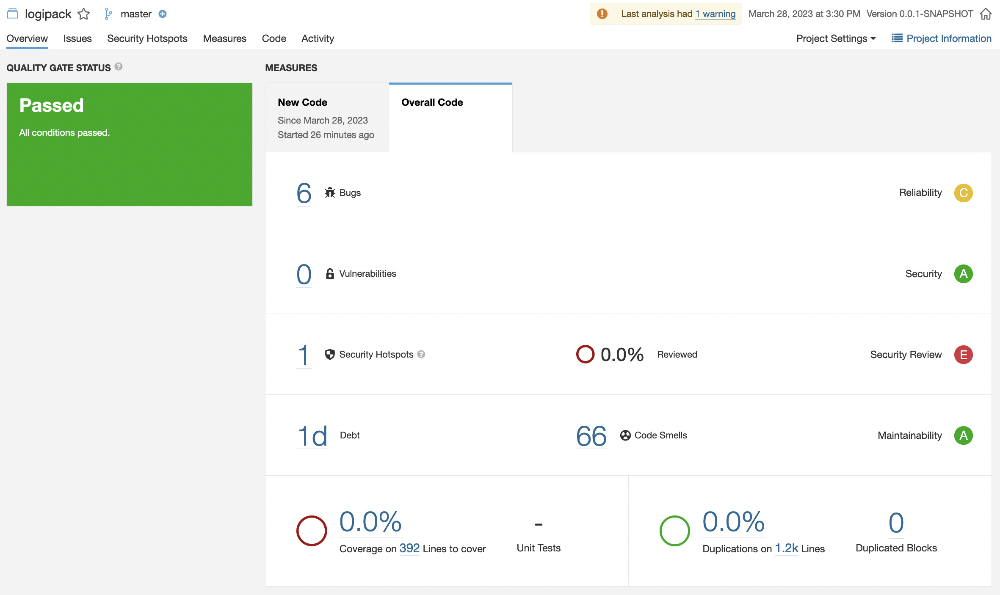
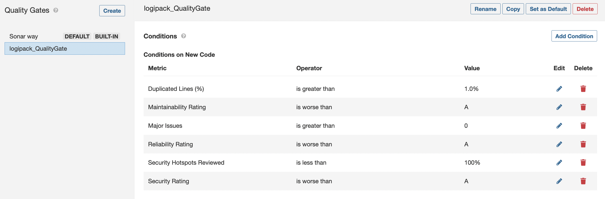
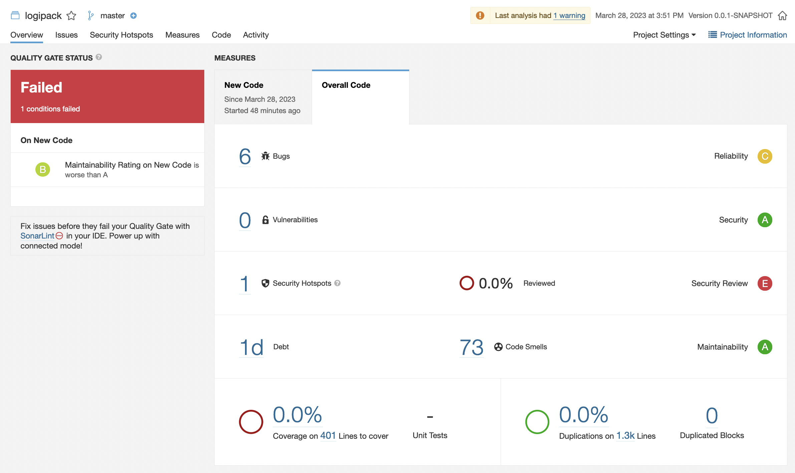

# Lab 6.3 - Custom QG

## A - IES project Quality Gate

After performing static code analysis on IES project the result obtained is the following:

 

We can create a custom Quality Gate to check the quality of the code.

The conditions selected for the Quality Gate are:

- Duplicated lines
- Maintainability Rating
- Major Issues
- Reliability Rating
- Security Hotspots Reviewed
- Security Rating

## B - Break Quality Gate

In order to test the conditions previously defined, we could modify the source code by:

- Adding duplicated blocks of code
- Variables that are not used

After write some code smells, the Quality Gate did not pass the conditions.

